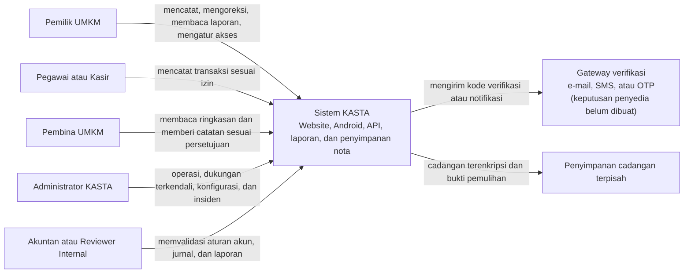
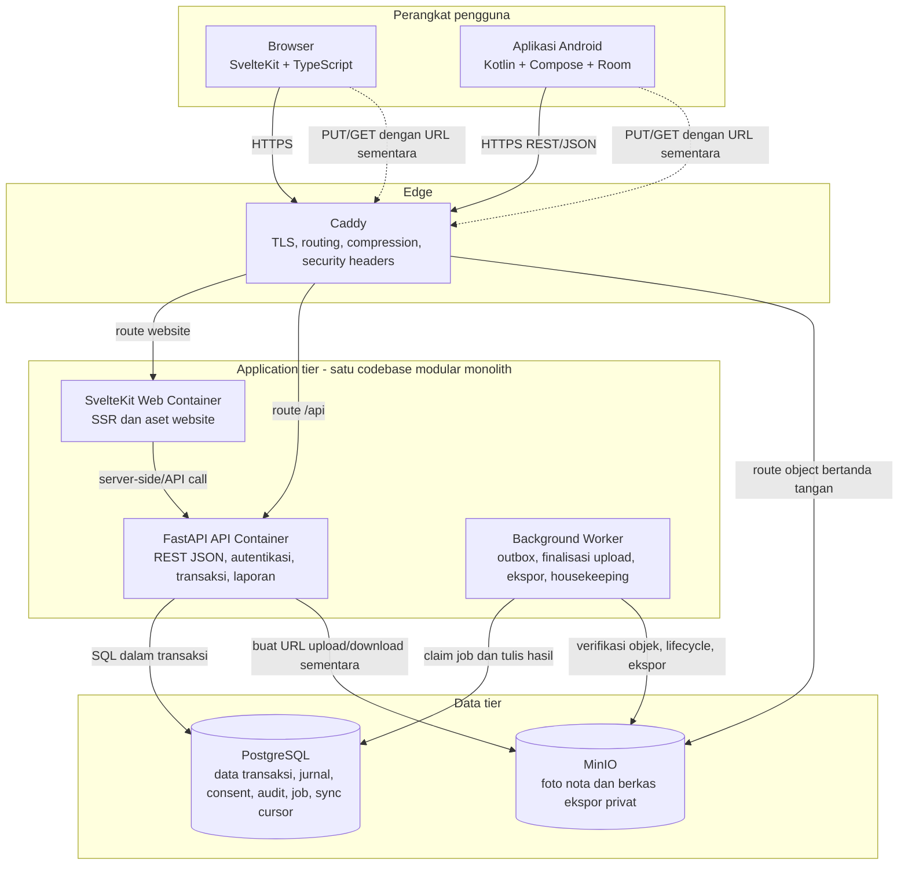
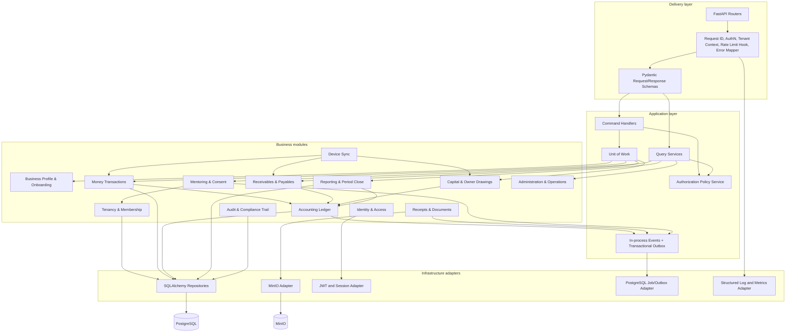
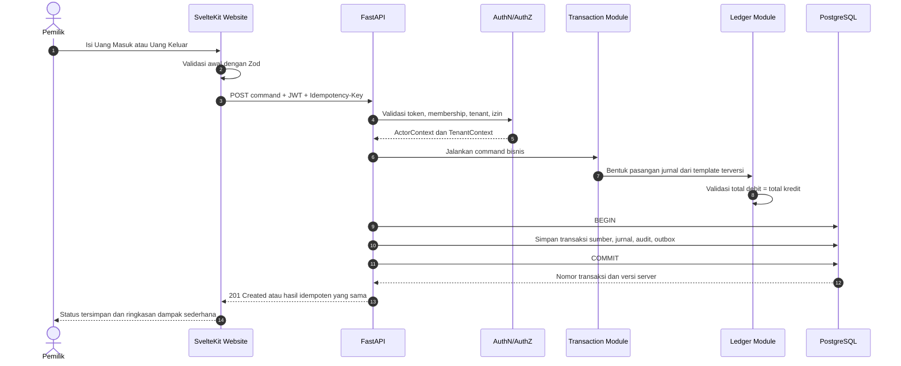
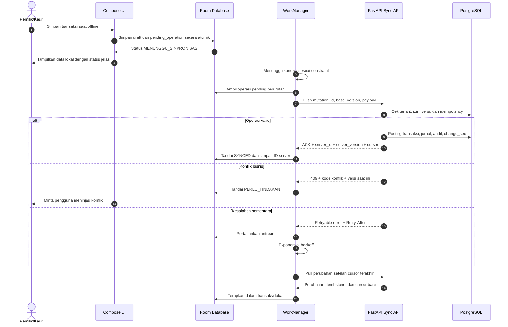
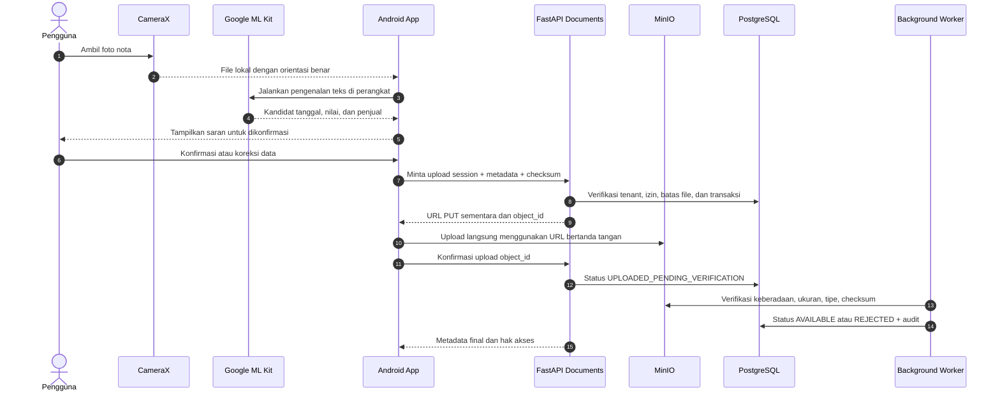

# Rancangan Arsitektur Sistem KASTA

**Pendekatan:** Modular Monolith  
**Versi:** 0.1  
**Status:** Baseline untuk validasi arsitektur, keamanan, akuntansi, dan operasional  
**Platform:** Website, Android, backend API, PostgreSQL, dan object storage  

## 1. Ringkasan Eksekutif

KASTA dibangun sebagai **modular monolith**: satu codebase backend, satu model deployment backend, dan satu basis data PostgreSQL, tetapi logika dipisahkan ke dalam modul bisnis dengan kepemilikan data, API internal, serta aturan dependensi yang jelas.

Pendekatan ini dipilih karena ruang lingkup MVP KASTA membutuhkan konsistensi transaksi yang kuat—khususnya antara transaksi usaha, jurnal double-entry, audit, persetujuan, dan laporan—sementara ukuran tim dan volume awal belum membenarkan kompleksitas microservices.

Keputusan arsitektur utama:

- Backend FastAPI menjadi satu-satunya sumber kebenaran untuk otorisasi, posting akuntansi, status transaksi final, laporan, dan akses foto nota.
- PostgreSQL menyimpan data transaksional, jurnal, metadata dokumen, persetujuan, audit, antrean pekerjaan, dan cursor sinkronisasi.
- MinIO hanya menyimpan objek biner; identitas, hak akses, checksum, status, serta keterkaitannya tetap disimpan di PostgreSQL.
- Website menggunakan API yang sama dengan Android. Tidak ada logika akuntansi otoritatif di sisi klien.
- Android menggunakan Room sebagai sumber data lokal untuk tampilan dan antrean operasi. Transaksi offline bersifat **menunggu sinkronisasi** sampai divalidasi dan diposting backend.
- Mesin akuntansi, transaksi sumber, audit log, dan outbox ditulis dalam satu transaksi database agar tidak terbentuk kondisi setengah tersimpan.
- Integrasi asynchronous pada MVP menggunakan transactional outbox dan worker dari codebase yang sama. Message broker belum diperlukan.
- Caddy direkomendasikan sebagai reverse proxy awal karena konfigurasi dan HTTPS otomatisnya sederhana. Nginx tetap merupakan alternatif bila lebih sesuai dengan kompetensi operasional tim.

### 1.1 Sasaran kualitas

1. Tidak ada transaksi keuangan terposting dengan jurnal tidak seimbang.
2. Tidak ada akses data lintas UMKM tanpa hubungan keanggotaan atau persetujuan yang sah.
3. Ketukan ulang, retry jaringan, dan sinkronisasi ulang tidak menghasilkan transaksi ganda.
4. Koreksi tidak menghapus sejarah; koreksi membentuk pembalikan dan versi pengganti.
5. Foto nota tidak pernah menjadi objek publik dan tidak dapat diakses lintas tenant.
6. Laporan website, Android, dan ekspor berasal dari snapshot serta aturan perhitungan yang sama.
7. Kegagalan jaringan tidak menghilangkan input Android yang sudah tersimpan lokal.

## 2. Karakter Modular Monolith KASTA

KASTA tetap disebut modular monolith walaupun API dan worker dapat dijalankan sebagai dua proses/container. Keduanya menggunakan image, codebase, model domain, versi rilis, dan basis data yang sama. Worker bukan layanan bisnis independen.

Aturan modularitas:

- Setiap modul memiliki domain model, application service, repository port, dan tabel yang menjadi tanggung jawabnya.
- Modul tidak mengakses tabel milik modul lain secara langsung.
- Interaksi lintas modul menggunakan application service, interface internal, atau domain event in-process.
- `shared_kernel` hanya berisi tipe dasar yang benar-benar lintas modul: ID, uang rupiah, waktu, actor context, tenant context, error dasar, dan abstraksi event.
- Tidak ada folder `utils` besar yang menjadi jalur pintas antarmodul.
- Satu unit of work membungkus operasi lintas modul yang harus atomik.
- Satu rantai migrasi Alembic digunakan agar urutan perubahan skema tetap deterministik; setiap perubahan tetap mempunyai pemilik modul.

## 3. System Context Diagram

### Batas sistem

Di dalam batas KASTA:

- Identitas aplikasi, keanggotaan UMKM, peran, dan persetujuan Pembina.
- Transaksi, jurnal double-entry, laporan, utang, piutang, modal, dan pengambilan pribadi.
- Metadata dan otorisasi Foto Nota.
- Sinkronisasi Android, audit, konfigurasi, ekspor, dan operasi dukungan.

Di luar batas KASTA:

- Kebenaran ekonomi transaksi yang dimasukkan pengguna.
- Pemberian pinjaman, credit scoring, e-faktur, perpajakan otomatis, payroll, dan audit eksternal.
- Gateway OTP/e-mail/SMS serta lokasi backup eksternal.

## 4. Container Diagram

### Tanggung jawab container

| Container | Tanggung jawab | Tidak boleh dilakukan |
|---|---|---|
| SvelteKit Web | Presentasi website, validasi UX, SSR, visualisasi, dan pemanggilan API | Menghitung jurnal atau memutuskan hak akses final |
| Android | Pengalaman mobile, penyimpanan lokal, kamera, OCR saran, antrean sinkronisasi | Menandai transaksi sebagai final sebelum ACK backend |
| FastAPI API | Validasi otoritatif, otorisasi, orkestrasi modul, unit of work, laporan, URL bertanda tangan | Menyimpan file biner nota di PostgreSQL |
| Worker | Menjalankan pekerjaan tertunda dari codebase yang sama | Menjadi pemilik domain atau basis data terpisah |
| PostgreSQL | Sumber kebenaran data terstruktur dan transaksi atomik | Menyimpan file foto besar |
| MinIO | Menyimpan objek privat, versioning, dan lifecycle | Menentukan siapa yang berhak melihat objek tanpa metadata dari backend |
| Caddy | TLS, reverse proxy, routing, batas request, dan header keamanan | Mengambil keputusan otorisasi bisnis |

## 5. Component Diagram Backend

### Aturan dependensi komponen

- Router hanya memanggil application service; router tidak mengakses repository.
- Pydantic adalah kontrak pada boundary. Domain entity tidak bergantung pada Pydantic.
- Otorisasi dilakukan sebelum query atau command sensitif dan diperiksa ulang pada service layer.
- Modul transaksi meminta Ledger memposting entry melalui interface, bukan menulis tabel jurnal secara langsung.
- Reporting hanya membaca entry terposting dan snapshot yang tervalidasi.
- Adapter MinIO tidak boleh memutuskan cakupan akses; modul Documents memberikan keputusan yang sudah diotorisasi.
- Worker menjalankan application service yang sama dengan API agar tidak terjadi duplikasi aturan bisnis.
- Worker mengklaim outbox/job menggunakan lease database dan penguncian aman untuk concurrency; setiap job mempunyai `not_before`, jumlah percobaan, lock expiry, serta dead-letter state.
- Setiap request atau job memperoleh satu SQLAlchemy `AsyncSession`/unit of work yang tidak dibagikan ke task concurrent. Transaksi dibuat singkat dan tidak menunggu panggilan jaringan eksternal.

## 6. Deployment Diagram

```mermaid
flowchart TB
    subgraph UserZone["Zona pengguna"]
        Phone["Android device"]
        Desktop["Browser desktop/mobile"]
    end

    Internet["Internet / DNS"]

    subgraph Host["Host Linux / VM - Docker Compose"]
        subgraph PublicNet["Public network"]
            Caddy["Caddy<br/>ports 80/443"]
        end

        subgraph PrivateNet["Private Docker network"]
            WebC["SvelteKit container"]
            ApiC["FastAPI container"]
            WorkerC["Worker container<br/>image sama dengan API"]
            PostgresC[("PostgreSQL container")]
            MinioC[("MinIO container")]
        end

        PgVol[("Encrypted PostgreSQL volume")]
        ObjVol[("Encrypted MinIO volume")]
        ProxyVol[("Caddy certificates/config volume")]
    end

    BackupTarget[("Backup target terpisah<br/>akun, host, atau lokasi berbeda")]
    GH["GitHub Actions"]
    Registry["Container Registry"]

    Phone -->|"HTTPS"| Internet
    Desktop -->|"HTTPS"| Internet
    Internet --> Caddy
    Caddy --> WebC
    Caddy --> ApiC
    Caddy --> MinioC
    ApiC --> PostgresC
    ApiC --> MinioC
    WorkerC --> PostgresC
    WorkerC --> MinioC
    PostgresC --- PgVol
    MinioC --- ObjVol
    Caddy --- ProxyVol
    PostgresC -->|"base backup, WAL, atau dump terenkripsi"| BackupTarget
    MinioC -->|"replication atau backup objek"| BackupTarget
    GH -->|"build, scan, test, sign"| Registry
    Registry -->|"pull image immutable"| WebC
    Registry -->|"pull image immutable"| ApiC
    Registry -->|"pull image immutable"| WorkerC
```

### Profil deployment

| Lingkungan | Topologi | Tujuan |
|---|---|---|
| Lokal | Semua container melalui Docker Compose; data sintetis | Pengembangan yang konsisten |
| CI | Container sementara PostgreSQL dan MinIO | Integration test, migrasi, dan contract test |
| Pilot | Satu host aplikasi dengan volume persisten dan backup di lokasi terpisah | Menekan biaya sambil menguji beban nyata |
| Produksi awal | Host aplikasi yang di-hardening; database dan object storage dapat tetap Compose bila risiko diterima | Operasi sederhana dengan runbook yang ketat |
| Produksi berkembang | Pisahkan database/object storage ke layanan atau host terkelola tanpa memecah modul aplikasi | Meningkatkan availability dan pemulihan sebelum mempertimbangkan microservices |

Docker Compose cukup untuk lokal, CI, pilot, dan produksi awal yang dikelola secara disiplin. Ia bukan pengganti high-availability orchestration. Pemisahan host database, replikasi, failover otomatis, dan multi-zone harus diputuskan berdasarkan RTO, RPO, volume, anggaran, dan kemampuan operasi.

## 7. Alur Komunikasi

### 7.1 Transaksi online dari website

Jika salah satu penyimpanan transaksi sumber, jurnal, audit, atau outbox gagal, seluruh transaksi database di-rollback. Tidak ada laporan yang membaca data setengah tersimpan.

### 7.2 Pencatatan Android saat offline dan sinkronisasi

### 7.3 Foto nota dan OCR

## 8. Pembagian Modul Backend

| Modul | Tanggung jawab | Data utama | Ketergantungan yang diizinkan |
|---|---|---|---|
| `identity_access` | Akun, kredensial, sesi, refresh token, MFA admin, perangkat | user, credential, session, device | shared kernel, audit |
| `tenancy` | UMKM sebagai tenant, membership, undangan, active tenant | tenant, membership, invitation | identity, audit |
| `business_profile` | Profil usaha, template usaha, onboarding, saldo awal workflow | business profile, onboarding state | tenancy, accounting port |
| `cash_accounts` | Kas, bank, dan perpindahan antar akun uang | money account, transfer | tenancy, ledger port |
| `transactions` | Uang Masuk, Uang Keluar, kategori kejadian, draft, koreksi | source transaction, transaction version | tenancy, ledger, documents, audit |
| `receivables` | Piutang, pelanggan, pembayaran sebagian/penuh, aging | receivable, receipt allocation | transactions, ledger |
| `payables` | Utang, pemasok, pembayaran sebagian/penuh, aging | payable, payment allocation | transactions, ledger |
| `capital` | Tambah Modal dan Ambil Uang Pribadi | capital contribution, owner drawing | tenancy, ledger |
| `accounting_ledger` | Bagan akun, template jurnal terversi, posting, reversal, periode | account, journal batch, journal line, period | tenancy; tidak bergantung pada reporting |
| `reporting` | Laba Rugi, Posisi Keuangan, rekonsiliasi modal, arus kas manajemen, ekspor | report snapshot, export request | ledger, receivable, payable |
| `documents` | Metadata Foto Nota, upload session, checksum, lifecycle, download grant | document, object reference, upload session | tenancy, object storage port |
| `mentoring` | Permintaan hubungan, consent, cakupan, kedaluwarsa, catatan Pembina | mentor relationship, consent, note | tenancy, reporting query port |
| `sync` | Mutation inbox, idempotency, device cursor, change feed, tombstone | sync operation, idempotency record, change log | application ports modul bisnis |
| `audit` | Jejak aktivitas, security event, export audit, manifest integritas | audit event, audit manifest | shared kernel |
| `platform_admin` | Status akun, konfigurasi terversi, health, support access, incident note | config version, support grant, incident | identity, tenancy, audit |

### 8.1 Struktur package konseptual

Setiap modul mengikuti pola yang sama:

- `domain`: entity, value object, invariant, dan domain event.
- `application`: command, query, handler, policy hook, serta port.
- `infrastructure`: model SQLAlchemy, repository, dan adapter eksternal.
- `presentation`: router dan schema Pydantic khusus modul.
- `tests`: unit, integration, contract, dan fixture milik modul.

Struktur ini adalah batas kepemilikan, bukan sekadar pengelompokan folder.

### 8.2 Skema PostgreSQL

Gunakan satu database dengan schema logis, misalnya `iam`, `tenancy`, `business`, `finance`, `ledger`, `reporting`, `documents`, `assistance`, `audit`, dan `platform`. Keuntungan pendekatan ini adalah kepemilikan tabel terlihat jelas, sementara transaksi lintas modul tetap atomik.

Satu Alembic revision chain dipertahankan. Setiap pull request migrasi wajib menyebut modul pemilik, strategi rollback, dampak data, serta kebutuhan expand/contract.

## 9. Model Data dan Invariant Kritis

Invariant yang wajib dipaksakan pada domain, database, atau keduanya:

1. Setiap record tenant-owned memiliki `tenant_id` yang tidak dapat berubah.
2. Foreign key antardata tenant memasukkan `tenant_id` agar referensi lintas UMKM ditolak.
3. Setiap jurnal terposting mempunyai paling sedikit dua baris dan jumlah debit sama dengan jumlah kredit.
4. Transaksi terposting tidak diubah atau dihapus secara fisik. Koreksi membentuk reversal dan versi pengganti.
5. Satu source transaction hanya mempunyai satu posting aktif untuk satu versi.
6. `mutation_id` atau `idempotency_key` unik dalam scope tenant dan actor/device yang tepat.
7. Pembayaran Utang atau Piutang tidak boleh melebihi saldo terbuka tanpa alur khusus yang disetujui.
8. Laporan final hanya membaca entry terposting dalam periode dan snapshot yang jelas.
9. Akses Pembina hanya valid bila hubungan, cakupan, tujuan, dan masa berlaku consent masih aktif.
10. Metadata dokumen tidak boleh berstatus `AVAILABLE` sebelum keberadaan, ukuran, tipe, dan checksum objek terverifikasi.

### 9.1 Transaksi posting akuntansi

Dalam satu transaksi PostgreSQL:

1. Kunci atau verifikasi aggregate/version yang relevan.
2. Periksa idempotency key.
3. Simpan transaksi sumber.
4. Pilih template akuntansi terversi.
5. Bentuk journal batch dan journal lines.
6. Validasi keseimbangan.
7. Simpan audit event.
8. Simpan outbox event dan change sequence.
9. Commit.

Tidak disarankan menyimpan saldo sebagai satu angka yang terus ditimpa tanpa rekonsiliasi. Bila projection saldo digunakan untuk kinerja, projection harus dapat dibangun ulang dari jurnal dan memiliki pemeriksaan integritas berkala.

## 10. Strategi Multi-Tenant

### 10.1 Model yang dipilih

Gunakan **shared database, shared tables, tenant discriminator** untuk MVP dan produksi awal. Namespace/schema PostgreSQL boleh dipisah per modul, tetapi tidak dibuat satu schema untuk setiap UMKM.

Alasan:

- Operasi dan migrasi lebih sederhana daripada schema/database per UMKM.
- Efisien untuk banyak tenant kecil dengan volume data rendah sampai menengah.
- Laporan portofolio Pembina dapat dibentuk tanpa menggabungkan banyak database.
- Tetap dapat dipisahkan kelak jika tenant tertentu membutuhkan isolasi khusus.

### 10.2 Pertahanan berlapis

1. `tenant_id` wajib pada semua tabel bisnis, jurnal, dokumen, audit tenant, dan change feed.
2. Tenant aktif berasal dari membership server-side; backend tidak mempercayai `tenant_id` dari payload saja.
3. Setelah transaksi database dimulai, backend menetapkan tenant context untuk transaksi tersebut.
4. PostgreSQL Row-Level Security digunakan sebagai defense in depth pada tabel tenant-owned.
5. Role koneksi aplikasi bukan superuser, bukan pemilik tabel, dan tidak memiliki `BYPASSRLS`.
6. Worker menetapkan tenant context untuk setiap job sebelum membaca atau menulis data.
7. Unique constraint dan foreign key menggunakan tenant scope.
8. Object key MinIO memakai prefix tenant dan ID acak, tetapi prefix bukan pengganti otorisasi.
9. Integration test mencoba akses lintas tenant melalui endpoint, repository, raw ID, URL dokumen, dan background job.

### 10.3 Data platform

Tabel seperti versi konfigurasi global dapat tidak memiliki `tenant_id`, tetapi diletakkan dalam schema platform dan hanya dapat diakses melalui modul Administrator. Akses dukungan ke data tenant memakai grant sementara, alasan/tiket, scope, kedaluwarsa, dan audit.

## 11. Strategi Autentikasi

### 11.1 Token dan sesi

- Access token berupa JWT bertanda tangan dengan umur pendek, direkomendasikan 10–15 menit.
- JWT minimal memuat `iss`, `aud`, `sub`, `iat`, `exp`, `jti`, dan `session_id`.
- Hak tenant yang mudah berubah tidak disimpan sebagai keputusan final di JWT. Membership dan policy tetap divalidasi server-side.
- Refresh token direkomendasikan berupa token acak opaque, disimpan hash-nya di database, dirotasi setiap penggunaan, dan memiliki reuse detection.
- Logout, pencabutan perangkat, perubahan risiko, atau reset kredensial menonaktifkan sesi server-side.
- Kunci penandatanganan mempunyai `kid`, jadwal rotasi, dan overlap verifikasi.

### 11.2 Website

- Refresh token disimpan dalam cookie `HttpOnly`, `Secure`, dan `SameSite` yang sesuai.
- Access token disimpan di memori atau dikelola melalui server-side session SvelteKit; hindari `localStorage` untuk token berumur panjang.
- Proteksi CSRF wajib untuk endpoint yang menggunakan cookie sebagai kredensial.
- Session fixation dicegah dengan menerbitkan ulang session ID setelah login atau perubahan privilege.

### 11.3 Android

- Refresh token atau material sesi disimpan menggunakan Android Keystore melalui penyimpanan terenkripsi, bukan di Room biasa.
- Access token hanya disimpan selama diperlukan dan diperbarui melalui authenticator Retrofit yang diserialisasi agar tidak terjadi refresh paralel.
- PIN lokal atau biometrik hanya membuka aplikasi/perangkat; keduanya bukan pengganti validasi backend.

### 11.4 Kredensial dan verifikasi

- Arsitektur menyediakan adapter untuk password, OTP nomor ponsel, atau magic link e-mail agar keputusan produk tidak mengikat domain.
- Password, bila digunakan, di-hash dengan algoritma modern seperti Argon2id dan parameter yang dapat ditingkatkan.
- Administrator wajib MFA. MFA untuk Pemilik direkomendasikan untuk ekspor, perubahan kredensial, dan tindakan sensitif.
- Endpoint login, refresh, OTP, dan pemulihan akses memiliki rate limit, cooldown, deteksi anomali, serta audit.

## 12. Strategi Otorisasi

Gunakan kombinasi **RBAC + ABAC + consent**:

- RBAC menentukan kemampuan dasar per peran.
- ABAC memeriksa tenant, membership aktif, resource, kepemilikan, periode, status transaksi, perangkat, dan konteks dukungan.
- Consent menentukan data Pembina yang boleh dibaca, tingkat detail, tujuan, serta masa berlaku.

| Peran | Kemampuan dasar | Batas penting |
|---|---|---|
| Pemilik | Kelola usaha, anggota, transaksi, laporan, consent, ekspor | Tindakan sensitif dapat memerlukan re-authentication |
| Pegawai/Kasir | Mencatat dan melihat riwayat yang diberi izin | Tidak melihat laporan penuh, konfigurasi akun, atau UMKM lain |
| Pembina | Membaca ringkasan dan memberi catatan pada hubungan aktif | Tidak mengubah transaksi; detail mengikuti consent |
| Administrator Operasi | Mengelola layanan dan status akun | Tidak memiliki akses default ke isi keuangan |
| Administrator Dukungan | Akses sementara sesuai tiket dan scope | Just-in-time, kedaluwarsa, seluruh aktivitas diaudit |
| Reviewer Akuntansi | Mengelola template/kebijakan melalui workflow | Tidak menyamar sebagai Pemilik dan tidak mengubah transaksi pengguna |

Aturan implementasi:

- Default deny.
- Policy diperiksa pada service layer, bukan hanya menyembunyikan menu.
- Query selalu menerima `ActorContext` dan `TenantContext` eksplisit.
- Backend memeriksa otorisasi untuk endpoint ID langsung, download, ekspor, filter, dan bulk operation.
- Perubahan peran, consent, serta support grant menaikkan versi policy/session agar cache keputusan lama tidak bertahan.
- RLS menjadi lapisan terakhir, bukan satu-satunya kontrol.

## 13. Strategi Offline-First Android

### 13.1 Sumber data lokal

Room menjadi sumber data yang dibaca UI Android. Repository menggabungkan local data source dan network data source, tetapi Compose selalu mengamati state dari Room agar pengalaman konsisten ketika jaringan berubah.

Kelompok data lokal:

- Read model: profil usaha, akun uang, kategori, pihak terkait, ringkasan, transaksi, Utang/Piutang, dan status dokumen.
- Draft: input pengguna yang belum siap disinkronkan.
- Pending operation: command yang siap dikirim beserta `mutation_id`, `base_version`, urutan, jumlah retry, dan status.
- Sync metadata: cursor per tenant, waktu sync, device ID, dan error terakhir.
- Local file metadata: lokasi foto, checksum, ukuran, dan status upload.

### 13.2 Status yang terlihat pengguna

- `DRAF`: belum masuk antrean.
- `MENUNGGU_SINKRONISASI`: aman di perangkat tetapi belum diterima server.
- `SEDANG_DIKIRIM`: WorkManager sedang mengirim.
- `TERSIMPAN`: sudah di-ACK dan mempunyai ID/versi server.
- `PERLU_TINDAKAN`: ditolak karena konflik atau data perlu diperbaiki.
- `GAGAL_SEMENTARA`: akan dicoba kembali.

Angka dari transaksi belum sinkron dapat ditampilkan sebagai **perkiraan lokal** dan harus dibedakan dari laporan final server.

### 13.3 Aksi yang wajib online

- Penutupan atau pembukaan kembali periode.
- Perubahan peran dan pencabutan akses.
- Persetujuan atau pencabutan Pembina.
- Ekspor laporan final.
- Perubahan kredensial, support access, dan tindakan administrator.
- Koreksi transaksi yang versi server terbarunya belum tersedia.

### 13.4 WorkManager

- Gunakan unique work per tenant dan device agar tidak ada dua drain queue paralel.
- Terapkan network constraint, exponential backoff, dan batas retry.
- Urutkan command yang saling bergantung; contoh: transaksi harus memperoleh ID server sebelum lampiran dikaitkan secara final.
- Satu kegagalan permanen tidak boleh memblokir seluruh antrean; operasi masuk dead-letter lokal dan tampil sebagai `PERLU_TINDAKAN`.

## 14. Strategi Sinkronisasi Data

### 14.1 Model push dan pull

**Push:** Android mengirim command, bukan menyalin row database. Setiap command mempunyai `mutation_id`, `device_id`, `tenant_id` terselesaikan server-side, aggregate ID lokal/server, `base_version`, tipe operasi, payload, dan waktu perangkat sebagai informasi saja.

**Pull:** Backend menyediakan change feed berurutan dengan `change_seq` server-side. Android menarik perubahan setelah cursor terakhir. Cursor tidak bergantung pada jam perangkat.

### 14.2 Idempotensi

- Backend menyimpan hasil command menurut idempotency scope dan payload hash.
- Pengiriman ulang payload yang sama mengembalikan hasil yang sama.
- Penggunaan key yang sama dengan payload berbeda ditolak sebagai konflik keamanan/data.
- Record idempotency mempunyai masa retensi lebih panjang daripada retry maksimum klien.

### 14.3 Kebijakan konflik

| Data | Kebijakan |
|---|---|
| Transaksi terposting | Tidak di-merge dan tidak ditimpa; koreksi menjadi reversal/versi baru |
| Draft transaksi | Optimistic locking dengan `base_version`; konflik dikembalikan untuk ditinjau |
| Pembayaran Utang/Piutang | Server menghitung ulang saldo saat posting; kelebihan pembayaran ditolak atau masuk alur khusus |
| Master sederhana | Field merge hanya untuk field tidak tumpang tindih; selain itu pengguna memilih |
| Preferensi nonkritis | Last-write-wins dapat diterima bila terdokumentasi |
| Consent, peran, periode | Server authoritative dan wajib online |
| Penghapusan | Tombstone disinkronkan; hard delete mengikuti retensi, bukan sync biasa |

### 14.4 Konsistensi

- Backend adalah sumber kebenaran untuk status final.
- Pull diterapkan ke Room dalam satu transaksi lokal.
- Cursor hanya maju setelah semua perubahan pada batch berhasil diterapkan.
- Perubahan baru selama pagination tidak mengubah snapshot/cursor awal batch.
- Full reconciliation tersedia jika cursor rusak atau versi protokol tidak kompatibel.
- Protokol sync mempunyai versi eksplisit agar Android lama dapat ditolak secara aman atau diberi masa kompatibilitas.

## 15. Strategi Penyimpanan Foto Nota

### 15.1 Alur aman

1. Klien mengambil atau memilih foto.
2. Klien memperbaiki orientasi, mengompresi secara wajar, menghitung SHA-256, dan menghapus metadata lokasi yang tidak diperlukan.
3. Klien meminta upload session kepada backend.
4. Backend memeriksa hak akses, ukuran, tipe yang diizinkan, kuota, dan relasi transaksi.
5. Backend membuat object ID dan URL PUT bertanda tangan dengan masa berlaku singkat.
6. Klien mengunggah langsung ke endpoint MinIO melalui HTTPS.
7. Klien mengonfirmasi upload.
8. Worker memverifikasi objek sebelum status `AVAILABLE`.

### 15.2 Aturan object storage

- Semua bucket privat; tidak ada anonymous read.
- Nama file pengguna tidak menjadi object key.
- Object key memakai ID acak dan prefix tenant, jenis objek, serta periode.
- Metadata database menyimpan tenant, pemilik resource, object key, checksum, ukuran, MIME tervalidasi, status, retention class, dan versi.
- Download dilakukan melalui URL GET bertanda tangan setelah otorisasi backend.
- URL bertanda tangan berumur pendek dan tidak dicatat lengkap di log.
- Presigner memakai domain object publik yang dirutekan Caddy; proxy tidak boleh mengubah host/path yang menjadi bagian signature.
- CORS MinIO dibatasi pada origin website KASTA, method, dan header yang benar-benar diperlukan.
- Aktifkan versioning untuk bucket yang membutuhkan perlindungan dari overwrite/delete.
- Lifecycle menghapus upload yang tidak pernah dikonfirmasi, thumbnail lama, dan objek yang melewati retensi yang disetujui.
- Backup MinIO berada di lokasi atau failure domain terpisah.

### 15.3 Kegagalan upload

- File offline tetap berada di app-specific storage sampai ACK final atau pengguna membatalkannya.
- Upload multipart dipertimbangkan hanya bila ukuran dan koneksi pilot membutuhkannya.
- Checksum berbeda, tipe tidak valid, atau ukuran berlebih menghasilkan status `REJECTED`; transaksi keuangan tetap tersimpan tanpa menjadikan foto syarat posting.
- Pembersihan file lokal dilakukan setelah objek `AVAILABLE`, dengan grace period untuk retry.

## 16. Strategi OCR

Google ML Kit dipakai sebagai OCR **on-device** untuk memberi saran, bukan untuk memposting akuntansi.

Pipeline:

1. CameraX memberi panduan framing, fokus, cahaya, dan pengambilan ulang.
2. ML Kit Text Recognition mengekstrak blok dan baris teks Latin.
3. Parser lokal mencari kandidat tanggal, total, pajak, dan nama penjual.
4. Kandidat diberi confidence berdasarkan kualitas gambar, pola, dan konsistensi angka.
5. Pengguna wajib mengonfirmasi atau mengoreksi.
6. Backend hanya menerima field yang sudah dikonfirmasi beserta provenance `manual`, `ocr_confirmed`, atau `ocr_corrected`.

Aturan:

- Tidak ada hasil OCR yang langsung menjadi jurnal.
- Bila confidence rendah atau ditemukan beberapa total, jangan memilih diam-diam.
- Simpan metrik agregat tingkat koreksi, bukan isi nota sensitif, untuk mengevaluasi kualitas.
- Raw OCR text tidak disimpan server-side secara default; keputusan ini harus ditinjau bersama privasi dan retensi.
- Model bundled direkomendasikan bila pilot membutuhkan OCR selalu tersedia offline; model melalui Google Play Services dapat dipilih untuk mengurangi ukuran aplikasi bila keterlambatan unduh awal dapat diterima.
- OCR server-side atau model khusus Indonesia adalah fase lanjutan setelah data pilot membuktikan manfaatnya.

## 17. Strategi Audit Log

Pisahkan dua konsep:

1. **Financial history:** transaksi sumber, journal batch, journal line, reversal, dan versi. Ini adalah catatan akuntansi yang tidak diubah.
2. **Operational/security audit:** siapa melakukan apa, terhadap resource mana, kapan, melalui perangkat/sesi apa, dan mengapa.

Field audit minimum:

- `event_id`, `occurred_at`, `tenant_id` bila relevan.
- `actor_id`, actor type, role efektif, dan support grant bila ada.
- action, module, resource type, resource ID, outcome.
- reason code dan alasan pengguna untuk tindakan sensitif.
- correlation ID, request ID, session ID, device ID.
- before/after diff yang telah direduksi dan disensor.
- alamat jaringan atau user agent yang diminimalkan sesuai kebijakan privasi.

Kontrol:

- Audit event penting ditulis dalam transaksi database yang sama dengan perubahan bisnis.
- Role aplikasi hanya boleh insert/select sesuai kebutuhan; tidak boleh update/delete audit normal.
- Token, password, URL bertanda tangan, isi nota, dan data sensitif tidak masuk audit/log.
- Ekspor, percobaan akses terlarang, perubahan peran, consent, support access, koreksi, penutupan periode, konfigurasi, dan restore wajib diaudit.
- Buat manifest hash harian untuk deteksi perubahan. Pada produksi matang, manifest dapat disimpan pada bucket dengan versioning/object lock atau media terpisah.
- Retensi audit ditetapkan bersama kebutuhan akuntansi, privasi, biaya, dan hukum sebelum produksi.

## 18. Strategi Backup dan Pemulihan

### 18.1 Target

Baseline kebutuhan KASTA menetapkan target awal maksimum RPO 24 jam dan RTO 8 jam. Untuk produksi, target yang lebih baik direkomendasikan setelah analisis dampak bisnis, misalnya RPO 15 menit dan RTO 4 jam. Target bukan dianggap terpenuhi sebelum restore drill membuktikannya.

| Aset | Strategi pilot | Strategi produksi | Verifikasi |
|---|---|---|---|
| PostgreSQL | Backup terjadwal terenkripsi dan salinan di host/lokasi berbeda | Base backup + WAL archiving untuk PITR, retensi bertingkat | Restore otomatis berkala dan rekonsiliasi ledger |
| MinIO | Versioning dan backup/sinkronisasi bucket ke target terpisah | Replication atau backup objek terenkripsi, versioning, lifecycle | Sampling checksum dan restore objek |
| Konfigurasi | Version control; secrets tidak masuk repository | Backup konfigurasi terenkripsi dan prosedur rekonstruksi | Disaster recovery drill |
| Audit manifest | Salinan bersama backup operasional | Salinan immutable atau failure domain terpisah | Verifikasi hash |
| Build artifact | Image bertag digest di registry | Retensi release dan SBOM | Uji rollback release |

### 18.2 Prinsip operasional

- Terapkan prinsip 3-2-1 sesuai kemampuan: tiga salinan, dua media/failure domain, satu di lokasi terpisah.
- Enkripsi saat transit dan saat tersimpan; kunci tidak diletakkan bersama backup tanpa kontrol.
- Backup database dan objek dikoordinasikan melalui checkpoint/manifest agar restore dapat direkonsiliasi.
- Runbook menjelaskan restore penuh, PITR, restore satu objek, credential rotation, dan validasi aplikasi.
- Restore drill minimum kuartalan dan setelah perubahan besar infrastruktur.
- Backup job yang berhasil belum cukup; keberhasilan ditentukan oleh pemulihan yang tervalidasi.

## 19. Strategi Error Handling

Gunakan format error API yang konsisten dan aman, selaras dengan Problem Details:

- kode stabil yang dapat dipetakan klien, misalnya `TRANSACTION_PERIOD_CLOSED`.
- judul dan pesan Bahasa Indonesia yang dapat dipahami pengguna.
- HTTP status yang tepat.
- `trace_id` atau `correlation_id` untuk dukungan.
- daftar field error untuk validasi.
- atribut `retryable` dan `retry_after` bila relevan.
- detail internal hanya di log server, tidak dikirim ke pengguna.

| Kondisi | HTTP | Perilaku klien |
|---|---:|---|
| Token tidak ada/kedaluwarsa | 401 | Refresh satu kali atau login kembali |
| Tidak mempunyai izin | 403 | Hentikan retry dan tampilkan penjelasan |
| Resource tidak ada/dilindungi | 404 | Jangan membocorkan keberadaan lintas tenant |
| Validasi input | 422 | Tunjukkan field dan cara memperbaiki |
| Konflik versi/periode/saldo | 409 | Tandai `PERLU_TINDAKAN`, jangan retry buta |
| Terlalu banyak request | 429 | Hormati `Retry-After` |
| Gangguan sementara | 503 | Retry terbatas dengan backoff |
| Error internal | 500 | Pesan aman + trace ID; alert bila memenuhi ambang |

Semua exception yang melewati application boundary dipetakan oleh error middleware. Database transaction wajib rollback. Android hanya melakukan retry otomatis pada error yang benar-benar retryable.

## 20. Strategi Logging

Gunakan structured logging JSON ke `stdout` agar dapat dikumpulkan dari container.

Field minimum:

- timestamp UTC, level, service, version, environment, module.
- request ID, correlation ID, trace ID.
- tenant ID opaque, actor ID opaque, session/device ID bila diperlukan.
- HTTP method, route template, status, duration, response size.
- event name, outcome, retry count, job age.
- error type dan stack trace hanya pada server.

Larangan:

- Jangan mencatat access token, refresh token, password, OTP, signed URL, cookie, atau header Authorization.
- Jangan mencatat isi Foto Nota atau raw OCR text.
- Hindari nominal, nama pelanggan/pemasok, nomor telepon, e-mail, dan payload penuh.
- Jangan memakai string log bebas sebagai satu-satunya sinyal; gunakan event name stabil.

Level:

- `DEBUG`: lokal atau sampling terbatas, nonaktif secara default di produksi.
- `INFO`: lifecycle request/job dan event operasional normal.
- `WARNING`: retry, konflik meningkat, batas kuota, atau anomali terpulihkan.
- `ERROR`: operasi gagal yang membutuhkan investigasi.
- `CRITICAL`: integritas ledger, kebocoran tenant, restore gagal, atau layanan inti tidak tersedia.

Retensi log dibedakan dari retensi audit. Log untuk diagnosis; audit untuk akuntabilitas.

## 21. Strategi Monitoring

### 21.1 Health endpoint

- `/live`: proses hidup; tidak menguji seluruh dependency.
- `/ready`: aplikasi siap menerima traffic, migrasi kompatibel, koneksi database tersedia, dan dependency kritis dapat dijangkau.
- Health worker: heartbeat, usia job tertua, dan outbox backlog.

### 21.2 SLI dan alert

| Area | SLI/metric | Alert awal |
|---|---|---|
| API | request rate, p50/p95/p99, 4xx/5xx per route | 5xx atau latency melewati burn-rate/ambang |
| Database | pool usage, connection wait, deadlock, slow query, storage | Pool hampir habis, deadlock berulang, disk menipis |
| Akuntansi | jurnal tidak seimbang, posting rollback, rekonsiliasi projection | Setiap jurnal tidak seimbang adalah critical |
| Sinkronisasi | backlog, usia operasi tertua, conflict rate, duplicate prevented | Backlog/usia meningkat terus |
| Dokumen | upload gagal, checksum mismatch, orphan object, storage usage | Rejection atau orphan melonjak |
| Worker | job success, retry, dead-letter, outbox age | Job kritis melewati SLA |
| Keamanan | login gagal, refresh reuse, denied cross-tenant, support access | Pola brute force atau akses lintas tenant |
| Backup | waktu backup terakhir, durasi, ukuran, restore drill | Backup terlambat atau restore gagal |
| Android | crash-free sessions, sync success, queue age agregat | Regresi crash atau sync setelah release |

Baseline stack dapat mengekspor metrics dan traces dengan format terbuka. Pemilihan backend observability—misalnya Prometheus/Grafana, OpenTelemetry collector, atau layanan error tracking—merupakan keputusan infrastruktur lanjutan dan tidak mengubah batas modul.

### 21.3 Dashboard operasional

Dashboard minimum:

1. Kesehatan layanan dan dependency.
2. Kinerja API dan database.
3. Integritas akuntansi serta kegagalan posting.
4. Sinkronisasi Android.
5. Upload Foto Nota dan kapasitas MinIO.
6. Authentication/security events.
7. Backup, restore drill, serta usia backup.

## 22. Keamanan Infrastruktur

- Hanya Caddy yang membuka port publik. PostgreSQL dan MinIO admin console tidak diekspos ke internet.
- Pisahkan Docker public network dan private network.
- Gunakan image non-root bila memungkinkan, filesystem read-only, capability minimum, dan resource limits.
- Secrets berasal dari secret store atau file berizin ketat, bukan image dan repository.
- Caddy menerapkan HTTPS, HSTS setelah domain stabil, security headers, batas body, dan timeout.
- Backup credentials berbeda dari application credentials.
- Database migration memakai role khusus; runtime role tidak mempunyai hak DDL.
- Pin dependency dan image digest; buat SBOM dan jalankan vulnerability scan di CI.
- Terapkan rate limit di edge dan aplikasi untuk login, OTP, ekspor, signed URL, dan endpoint mahal.
- Lakukan threat modeling khusus cross-tenant access, IDOR, token theft, offline data theft, upload berbahaya, dan support access.

## 23. Strategi Pengujian

### 23.1 Backend dengan Pytest

- Unit test domain untuk invariant dan mapping kejadian bisnis ke jurnal.
- Table-driven test seluruh template transaksi.
- Property-based test untuk keseimbangan debit/kredit, reversal, alokasi pembayaran, dan idempotensi.
- Integration test dengan PostgreSQL dan MinIO nyata dalam container.
- RLS test dengan dua atau lebih tenant dan percobaan akses lintas tenant.
- Contract test OpenAPI untuk website dan Android.
- Concurrency test untuk retry ganda, pembayaran bersamaan, dan penutupan periode.
- Migration test dari snapshot database versi sebelumnya.
- Backup/restore test dan rekonsiliasi golden dataset.

### 23.2 Website

- Unit test schema Zod, store, formatter, dan adapter API.
- Component test untuk status draft/sync/error dan aksesibilitas.
- End-to-end test alur Uang Masuk, Uang Keluar, laporan, consent, dan ekspor.
- Visual regression untuk dashboard dan laporan kritis.

### 23.3 Android

- Unit test ViewModel, repository, conflict resolver, dan parser OCR.
- Room migration test.
- WorkManager test untuk unique work, retry, dead-letter, dan restart perangkat.
- MockWebServer/contract test Retrofit.
- Instrumentation test CameraX pada perangkat representatif.
- Uji jaringan: offline, lambat, putus setelah request, retry, dan clock perangkat salah.

### 23.4 Golden accounting dataset

Sediakan dataset lintas jenis usaha yang berisi transaksi normal, nol, batas, salah kategori, pembayaran sebagian, koreksi, pembatalan, saldo awal, dan penutupan periode. Dataset menghasilkan jurnal serta laporan ekspektasi yang disetujui reviewer akuntansi. Semua perubahan template wajib lulus dataset historis tersebut.

## 24. Strategi CI/CD dengan GitHub Actions

Pipeline pull request:

1. Lint dan static type check Python/Kotlin/TypeScript.
2. Unit test backend, website, dan Android.
3. Bangun container PostgreSQL dan MinIO sementara untuk integration test.
4. Jalankan Alembic upgrade dari database kosong dan snapshot versi sebelumnya.
5. Jalankan security test, dependency scan, secret scan, dan image scan.
6. Bangun website, backend image, dan Android artifact.
7. Validasi OpenAPI/contract dan golden accounting dataset.

Pipeline release:

1. Build image sekali dan beri tag immutable berdasarkan commit SHA/digest.
2. Buat SBOM dan provenance artifact.
3. Deploy ke staging.
4. Jalankan smoke test, migration check, dan synthetic accounting transaction.
5. Persetujuan manual untuk produksi.
6. Backup/checkpoint sebelum migrasi berisiko.
7. Deploy dengan health gate.
8. Verifikasi metric, error, sync, serta rekonsiliasi.
9. Rollback aplikasi bila perlu; rollback skema mengikuti strategi migrasi, bukan downgrade buta.

Gunakan migrasi **expand/contract** untuk produksi: tambah struktur kompatibel, deploy aplikasi yang mendukung dua bentuk bila perlu, migrasikan data, pindahkan pembacaan, lalu hapus struktur lama pada release terpisah.

## 25. Strategi Pengembangan dari MVP hingga Produksi

| Tahap | Fokus arsitektur | Keluaran | Gerbang keluar |
|---|---|---|---|
| 0. Validasi keputusan | Kebijakan akuntansi, tenant, login, consent, retensi, RPO/RTO | ADR dan threat model awal | Sponsor, accounting, security, product menyetujui |
| 1. Foundation | Repo, module boundaries, CI, PostgreSQL, MinIO, Caddy, identity, tenancy, audit | Skeleton modular monolith dan environment konsisten | Test isolation dan migration pipeline lulus |
| 2. Vertical slice | Uang Masuk end-to-end sampai jurnal, laporan, audit, web, Android sync | Bukti arsitektur lintas layer | Golden test dan retry/idempotency lulus |
| 3. MVP incremental | Uang Keluar, kas/bank, modal, pribadi, Utang/Piutang, nota, role, consent | Fitur Must Have | Semua invariant dan acceptance criteria kritis lulus |
| 4. Hardening | RLS, auth hardening, backup, restore, observability, performance, accessibility | Release candidate | Security review, restore drill, performance gate lulus |
| 5. Pilot terbatas | Perangkat/koneksi nyata, onboarding, support, kualitas OCR/sync | Baseline produk dan operasi | Tidak ada risiko sistemik; metrik mendekati target |
| 6. Produksi awal | SLO, on-call, incident response, capacity, DR | Go-live terbatas | Runbook, monitoring, backup, owner operasional siap |
| 7. Scale | Pisahkan data tier, read projection, worker scaling, caching bila terbukti | Kapasitas meningkat tanpa memecah domain | Bottleneck terukur dan perubahan memiliki manfaat |

### Kapan mempertimbangkan keluar dari modular monolith

Jangan memecah menjadi microservices hanya karena jumlah modul bertambah. Pertimbangkan ekstraksi bila terdapat bukti:

- Modul memiliki kebutuhan scaling yang sangat berbeda dan menjadi bottleneck nyata.
- Tim independen membutuhkan cadence rilis terpisah.
- Batas data dan transaksi sudah stabil serta tidak memerlukan transaksi lintas layanan.
- Isolasi keamanan atau regulasi mewajibkan deployment terpisah.
- Kegagalan satu fungsi harus diisolasi dengan SLO berbeda.

Kandidat ekstraksi masa depan yang relatif aman adalah document processing/OCR dan export generation. Accounting ledger sebaiknya tetap dekat dengan transaksi sampai konsistensi lintas layanan dapat dibuktikan.

## 26. Alasan Pemilihan Teknologi

### 26.1 Backend

| Teknologi | Alasan | Risiko/keterbatasan dan mitigasi |
|---|---|---|
| Python | Produktif untuk domain bisnis, ekosistem testing kuat, mudah dibaca lintas fungsi | Kinerja CPU bukan yang tertinggi; gunakan query efisien, profiling, dan worker untuk tugas berat |
| FastAPI | Kontrak OpenAPI otomatis, dependency injection ringan, async-friendly, dan integrasi security yang jelas | Hindari business logic di dependency/router; batasi pada delivery layer |
| SQLAlchemy 2 | Unit of work, transaction boundary, mapping eksplisit, dan dukungan query modern | ORM dapat menyembunyikan query mahal; gunakan eager-loading terukur, query review, dan slow-query monitoring |
| Alembic | Migrasi schema yang selaras dengan SQLAlchemy dan dapat direview | Autogenerate tidak memahami seluruh niat; migrasi wajib diperiksa dan diuji |
| PostgreSQL | ACID, constraint kuat, JSONB bila perlu, RLS, indexing matang, dan cocok untuk ledger | RLS/indeks harus diuji; gunakan role non-owner dan observability database |
| Pydantic | Validasi dan serialisasi boundary dengan type hints | Jangan menjadikan model API sebagai domain entity |
| JWT | Access token terverifikasi tanpa state lookup untuk validitas tanda tangan | Revocation dan permission drift; gunakan access token singkat dan session server-side |
| Pytest | Fixture, parametrization, plugin ecosystem, dan cocok untuk golden accounting test | Fixture berlebihan dapat menyembunyikan intent; gunakan builder/domain fixture yang jelas |

### 26.2 Website

| Teknologi | Alasan | Risiko/keterbatasan dan mitigasi |
|---|---|---|
| SvelteKit | Routing, SSR, form/data loading, serta bundle UI yang ringan untuk perangkat menengah | Tegaskan boundary server/browser dan strategi token sejak awal |
| TypeScript | Mengurangi kesalahan kontrak UI dan meningkatkan refactoring | Tipe compile-time tidak memvalidasi data jaringan; tetap gunakan Zod |
| Tailwind CSS | Mempercepat UI konsisten dan responsive dengan design tokens | Utility dapat menjadi tidak konsisten; tetapkan komponen dan token KASTA |
| Zod | Validasi runtime TypeScript-first untuk form, URL state, dan response boundary | Hindari menduplikasi aturan domain; backend tetap otoritatif |
| Apache ECharts | Visualisasi interaktif kaya, responsif, dan sesuai dashboard keuangan | Chart dapat berat dan tidak otomatis aksesibel; lazy-load, batasi data, dan sediakan tabel/teks alternatif |

### 26.3 Android

| Teknologi | Alasan | Risiko/keterbatasan dan mitigasi |
|---|---|---|
| Kotlin | Bahasa utama Android dengan null safety dan coroutine | Tetapkan style, static analysis, dan structured concurrency |
| Jetpack Compose | UI deklaratif, state-driven, dan cocok untuk status sinkronisasi | Hindari state tidak stabil dan recomposition berlebih; ukur pada perangkat bawah |
| Room | Database lokal terstruktur, observable, dan cocok sebagai source of truth offline | Migrasi schema wajib diuji; data sensitif memerlukan proteksi tambahan |
| WorkManager | Pekerjaan persisten dengan constraint dan retry untuk drain queue | Bukan real-time scheduler; UI tetap menampilkan status dan sync manual |
| Retrofit | HTTP client declarative dan mudah diintegrasikan dengan converter/interceptor | Refresh token dan retry harus diserialisasi agar tidak menggandakan request |
| Hilt | Dependency injection terstandar dan mudah diuji | Jaga graph sederhana; jangan menyembunyikan service locator global |
| CameraX | Abstraksi kamera modern dengan integrasi lifecycle | Perilaku vendor berbeda; uji pada matriks perangkat pilot |
| Google ML Kit | OCR on-device, mendukung mode offline, dan cocok untuk saran input nota | Akurasi bergantung foto; selalu minta konfirmasi dan ukur correction rate |

### 26.4 Infrastruktur

| Teknologi | Alasan | Risiko/keterbatasan dan mitigasi |
|---|---|---|
| Docker Compose | Lingkungan multi-container konsisten untuk lokal, CI, pilot, dan produksi awal | HA/failover terbatas; pisahkan data tier saat SLO menuntut |
| PostgreSQL | Satu sumber transaksi dan antrean awal mengurangi moving parts | Job queue database perlu batas dan monitoring; broker baru ditambah bila terbukti perlu |
| MinIO | Object storage privat dengan API bergaya S3, versioning, lifecycle, dan opsi object lock | Operasi distributed storage tidak sederhana; untuk skala awal gunakan topologi yang dapat dipulihkan dan backup terpisah |
| Caddy | Reverse proxy sederhana dan HTTPS otomatis | Tim harus memahami trusted proxy, header, timeout, dan penyimpanan sertifikat; Nginx dapat dipilih bila kompetensi internal lebih kuat |
| GitHub Actions | CI/CD dekat repository, matrix build, artifact, environment approval | Pin action by commit SHA, batasi permission, lindungi secret, dan gunakan protected environment |

## 27. Keputusan Arsitektur yang Masih Terbuka

1. Metode login MVP: password, OTP ponsel, magic link e-mail, atau kombinasi.
2. Penyedia gateway verifikasi dan notifikasi.
3. Apakah SvelteKit berjalan SSR penuh atau sebagian besar static dengan BFF ringan.
4. RPO/RTO produksi yang disetujui dan anggaran untuk database/object storage terpisah.
5. Masa retensi transaksi, audit, log, raw OCR, foto nota, ekspor, dan idempotency record.
6. Batas ukuran/format Foto Nota dan kuota per UMKM.
7. Model ML Kit bundled atau unbundled berdasarkan ukuran aplikasi dan kebutuhan offline pilot.
8. Tingkat detail consent Pembina dan apakah unduhan ringkasan diizinkan.
9. Kebijakan minimum Android dan daftar perangkat pilot.
10. Backend observability yang dipilih untuk metrics, traces, alert, dan crash reporting.
11. Apakah production awal menerima PostgreSQL/MinIO dalam satu host atau harus dipisah sejak pilot.
12. Batas performa dan volume yang memicu read replica, projection khusus, cache, atau message broker.

Keputusan tersebut sebaiknya dicatat sebagai Architecture Decision Record (ADR) dengan konteks, pilihan, keputusan, konsekuensi, owner, dan tanggal review.

## 28. Rekomendasi Akhir

Mulai dengan satu vertical slice Uang Masuk yang melewati seluruh arsitektur: website dan Android, autentikasi, tenant, idempotensi, posting jurnal, audit, outbox, laporan, observability, serta backup test. Irisan ini harus membuktikan kualitas arsitektur sebelum semua jenis transaksi dibangun.

Prioritas teknis tertinggi bukan menambah fitur, melainkan memastikan:

- batas modul dapat diuji;
- tenant tidak bocor;
- transaksi dan jurnal atomik;
- retry tidak menggandakan transaksi;
- status offline dipahami pengguna;
- restore benar-benar berhasil;
- laporan dapat ditelusuri ke transaksi sumber.

## 29. Rujukan Resmi

- [FastAPI — OAuth2 dengan bearer JWT](https://fastapi.tiangolo.com/tutorial/security/oauth2-jwt/)
- [SQLAlchemy 2 — Session basics dan transaction scope](https://docs.sqlalchemy.org/en/20/orm/session_basics.html)
- [Alembic — dokumentasi migrasi](https://alembic.sqlalchemy.org/en/latest/)
- [PostgreSQL — Row Security Policies](https://www.postgresql.org/docs/current/ddl-rowsecurity.html)
- [Pydantic — dokumentasi](https://docs.pydantic.dev/latest/)
- [SvelteKit — dokumentasi](https://svelte.dev/docs/kit)
- [Zod — TypeScript-first schema validation](https://zod.dev/)
- [Apache ECharts — fitur](https://echarts.apache.org/en/feature.html)
- [Android Developers — offline-first data layer](https://developer.android.com/topic/architecture/data-layer/offline-first)
- [Android Developers — Room](https://developer.android.com/training/data-storage/room)
- [Android Developers — WorkManager](https://developer.android.com/topic/libraries/architecture/workmanager)
- [Android Developers — CameraX](https://developer.android.com/media/camera/camerax)
- [Google ML Kit — Text Recognition v2](https://developers.google.com/ml-kit/vision/text-recognition/v2/android)
- [Retrofit — dokumentasi resmi](https://square.github.io/retrofit/)
- [Docker — Compose](https://docs.docker.com/compose/)
- [MinIO — Object Management](https://min.io/docs/minio/linux/administration/object-management.html)
- [Caddy — Automatic HTTPS](https://caddyserver.com/docs/automatic-https)
- [GitHub — Actions](https://docs.github.com/en/actions/get-started)

---

Dokumen ini adalah baseline arsitektur, bukan implementasi kode lengkap. Nilai timeout, retensi, kuota, RPO/RTO, algoritma kredensial, dan versi minimum platform harus ditutup melalui keputusan formal sebelum produksi.
