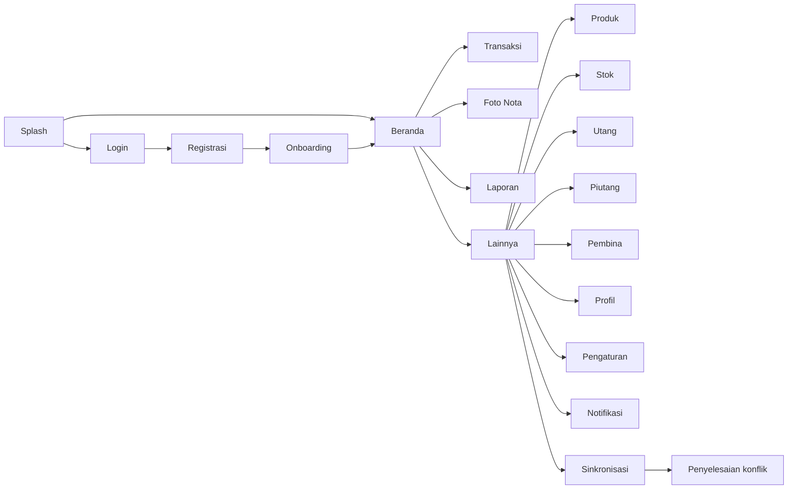

# Aplikasi Android KASTA

Aplikasi Android menggunakan package `id.kasta.app`, Kotlin, Jetpack Compose, Material 3, Hilt,
Room, Retrofit, WorkManager, CameraX, ML Kit, Coroutines, Flow, Navigation Compose, dan DataStore.

## Navigasi



Bottom navigation menggunakan lima tujuan utama: Beranda, Transaksi, Foto Nota, Laporan, dan
Lainnya. Layar detail menyembunyikan bottom bar agar pengguna berfokus pada tugasnya.

## Arsitektur pragmatis

- `presentation/navigation`: route dan shell navigasi.
- `presentation/home`, `presentation/auth`, `presentation/more`, `presentation/settings`: screen dan
  ViewModel.
- `presentation/components` dan `presentation/theme`: design system Compose dan preview.
- `domain/model`, `domain/repository`, `domain/usecase`: aturan dashboard yang tidak bergantung pada
  UI.
- `data/repository`: implementasi repository menggunakan Room atau Retrofit.
- `data/local`: database Room serta preferensi DataStore.
- `data/remote`: kontrak Retrofit dan DTO.

Modul `transactions`, `receiptscan`, `inventory`, `obligations`, `reports`, dan `mentoraccess` tetap
digunakan oleh navigation shell. Ini menjaga fitur yang telah diuji sambil memungkinkan migrasi
bertahap ke struktur presentation/domain/data.

## Offline-first

Room menjadi sumber data utama dashboard dan transaksi. Transaksi offline diberi status `PENDING`,
dikirim WorkManager ketika jaringan tersedia, dan berubah menjadi `SYNCED`, `FAILED`, atau
`CONFLICT`. Konflik transaksi keuangan diselesaikan manual melalui layar Penyelesaian Konflik.
DataStore menyimpan ID perangkat, cursor, waktu sinkronisasi, mode gelap, dan preferensi notifikasi.
Inbox notifikasi disimpan di Room. WorkManager menarik inbox ketika jaringan tersedia dan membuat
pengingat transaksi lokal saat offline. Ketukan notifikasi membuka layar transaksi, tagihan, stok,
nota, sinkronisasi, pembina, atau laporan sesuai `action_path`.

## Pemeriksaan kualitas

Gunakan JDK 17 dan Android SDK 35:

```powershell
$env:JAVA_HOME='C:\Program Files\Microsoft\jdk-17.0.19.10-hotspot'
$env:ANDROID_HOME='C:\android'
.\gradlew.bat ktlintCheck testDebugUnitTest assembleDebug
```

APK debug dihasilkan pada `apps/android/app/build/outputs/apk/debug/app-debug.apk`.
