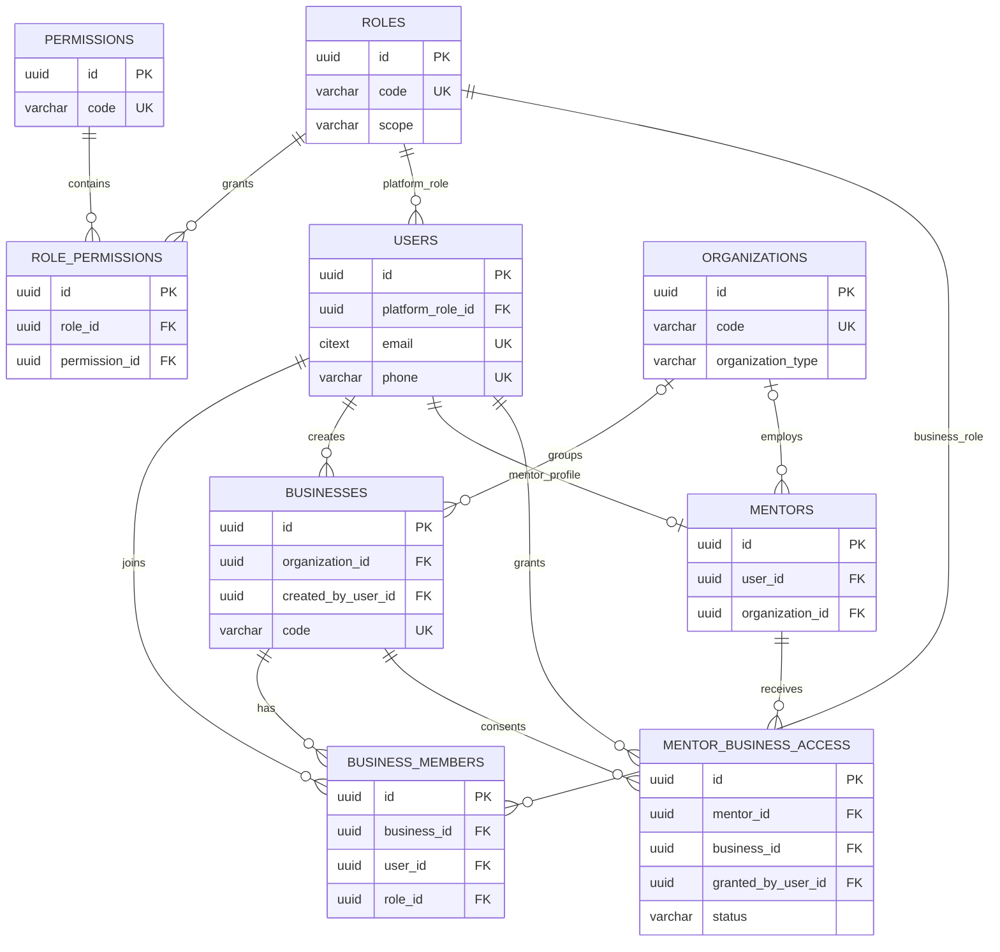
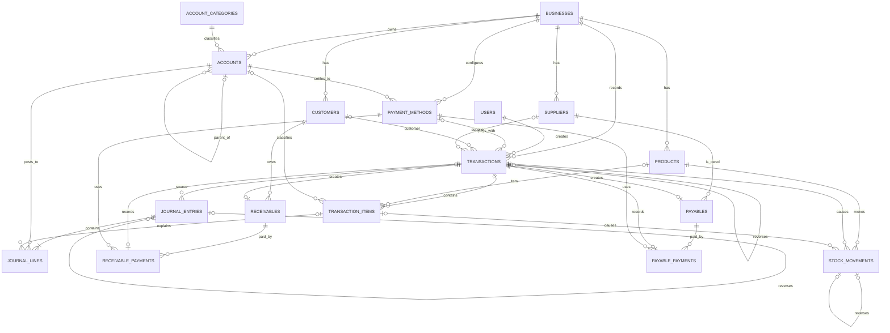
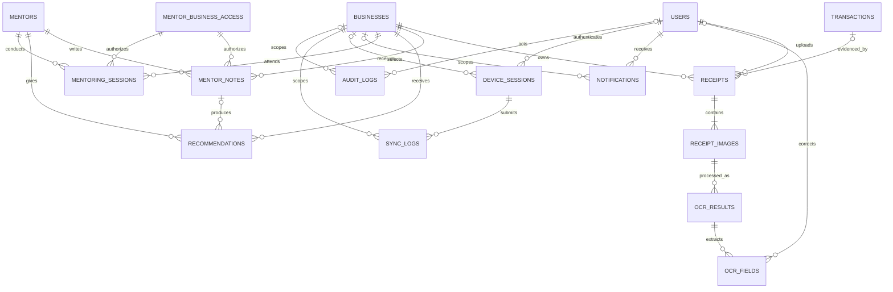

# Desain Database KASTA

## 1. Ruang lingkup dan keputusan tipe data

Skema menggunakan namespace PostgreSQL `kasta`. UUID adalah identifier publik. Nilai uang selalu
`NUMERIC(18,2)` dan kuantitas stok `NUMERIC(18,4)`. Kode mata uang memakai `CHAR(3)` dengan default
`IDR`. Timestamp menggunakan `TIMESTAMPTZ`; tanggal dokumen akuntansi menggunakan `DATE`.

Status disimpan sebagai `VARCHAR` dengan `CHECK`, bukan PostgreSQL enum, agar penambahan status dapat
dilakukan lewat migration tanpa ketergantungan enum global. Email memakai `CITEXT`. Payload fleksibel
seperti alamat, metadata OCR, dan notifikasi memakai `JSONB`, tetapi data yang menjadi invariant atau
filter utama tetap memiliki kolom bertipe kuat.

## 2. ERD

ERD dipecah menjadi tiga konteks agar dapat dibaca. `BUSINESSES` adalah akar tenant dan muncul pada
lebih dari satu diagram.

### 2.1 Identitas, tenant, role, dan akses pembina



### 2.2 Transaksi, double-entry, pihak, produk, stok, utang, dan piutang



Setiap relasi antarentitas tenant pada DDL menggunakan pasangan `(business_id, foreign_id)`, bukan
hanya `foreign_id`. Karena parent memiliki `UNIQUE (business_id, id)`, PostgreSQL menolak referensi
customer, akun, produk, jurnal, atau dokumen dari UMKM lain walaupun aplikasi salah mengirim UUID.

### 2.3 Nota, OCR, pendampingan, notifikasi, sinkronisasi, dan audit



## 3. Relasi dan kardinalitas penting

- Satu `organization` dapat menaungi banyak `businesses` dan `mentors`; keduanya boleh independen.
- Pengguna menjadi anggota banyak UMKM melalui `business_members`; kombinasi aktif pengguna–UMKM
  unik. Role bisnis ditentukan pada membership, bukan pada `users`.
- `mentors` adalah profil satu-ke-satu opsional dari `users`. Relasi many-to-many mentor–UMKM dan
  persetujuan pemilik disimpan historis pada `mentor_business_access`.
- Satu transaksi memiliki nol atau banyak item dan, ketika `POSTED`, sedikitnya satu jurnal posted.
  Satu jurnal mempunyai minimal dua baris debit/kredit.
- Piutang terkait pelanggan; utang terkait pemasok. Pembayaran selalu menjadi transaksi tersendiri
  sehingga kas, saldo pihak, dan jurnal mempunyai sumber audit yang sama.
- Perubahan stok selalu mengacu ke transaksi dan produk; pembalikan menggunakan movement lawan.
- Satu nota dapat mempunyai beberapa gambar, setiap gambar dapat memiliki beberapa percobaan OCR,
  dan hanya satu hasil OCR aktif per gambar.
- Catatan, rekomendasi, dan sesi pembinaan mengacu ke baris izin yang berlaku saat dibuat.
- `audit_logs` berelasi polimorfik lewat `entity_type` dan `entity_id`; tidak memakai FK generik.

## 4. Invariant akuntansi dan transaksi database

Posting dilakukan oleh satu application service dalam satu transaksi PostgreSQL:

1. kunci aggregate transaksi, nomor dokumen, saldo piutang/utang, dan stok relevan dengan
   `SELECT ... FOR UPDATE` atau advisory lock terukur;
2. validasi tenant, status draft, tanggal, mata uang, jumlah, dan permission;
3. buat/ubah `transactions` dan `transaction_items`;
4. buat `journal_entries` beserta minimal dua `journal_lines`;
5. buat `stock_movements`, receivable/payable, atau payment bila relevan;
6. ubah status menjadi `POSTED`; constraint deferred memeriksa debit = kredit dan keberadaan jurnal;
7. tulis audit dalam transaksi yang sama; commit sekali.

Jumlah debit dan kredit adalah nilai positif terpisah. Setiap baris wajib mengisi tepat satu sisi.
Total debit dan kredit memakai `NUMERIC(18,2)`, harus sama dan lebih besar dari nol saat posted.
Saldo akun, stok, piutang, dan utang tidak diubah dengan float atau operasi di klien.

## 5. Aturan larangan hapus transaksi

Tabel berikut bersifat financial record: `transactions`, `transaction_items`, `journal_entries`,
`journal_lines`, `stock_movements`, `receivables`, `receivable_payments`, `payables`, dan
`payable_payments`.

- `DELETE` fisik selalu ditolak trigger, termasuk oleh aplikasi.
- `deleted_at` hanya boleh dipakai untuk draft yang belum pernah diposting.
- Record posted immutable. Koreksi membuat transaksi/jurnal/payment/stock movement pembalik dengan
  UUID baru dan referensi `reversal_of_*`.
- Original dapat berubah satu kali dari `POSTED` ke `VOIDED`/`REVERSED` hanya untuk metadata void;
  tanggal, nilai, akun, item, dan pelaku awal tidak berubah.
- Reversal harus diposting pada periode terbuka, memiliki alasan dan aktor, serta ikut audit log.
- Purge karena retensi hanya boleh menyasar payload non-ledger yang diizinkan kebijakan (misalnya
  raw OCR atau object nota), bukan catatan keuangannya.

## 6. Row-Level Security

Semua tabel tenant memiliki `business_id NOT NULL`. API membuka transaksi database dan mengatur:

```sql
SET LOCAL app.user_id = '<user-uuid>';
SET LOCAL app.business_id = '<business-uuid>';
SET LOCAL app.is_platform_admin = 'false';
```

RLS memeriksa `business_id = kasta.current_business_id()`. Tabel `businesses` memeriksa `id`.
Notifikasi dan sesi perangkat memiliki policy khusus karena `business_id` boleh `NULL`. `users`
hanya dapat dibaca pemilik row atau platform admin.

Backend harus lebih dahulu memvalidasi membership aktif atau `mentor_business_access` aktif beserta
scope (`summary`, laporan, transaksi, nota, catatan, rekomendasi). Baru setelah itu backend memilih
tenant context. RLS tidak menggantikan permission per use case; RLS mencegah kebocoran lintas tenant
jika filter aplikasi terlupa.

Aturan operasional:

- role runtime API bukan owner tabel dan tidak memiliki `BYPASSRLS`;
- owner migration terpisah, tidak dipakai aplikasi;
- gunakan `FORCE ROW LEVEL SECURITY`;
- `SET LOCAL`, bukan `SET`, agar connection pool tidak membawa tenant ke request berikutnya;
- fungsi `SECURITY DEFINER` memakai `search_path` tetap, owner terkunci, dan izin execute minimum;
- job lintas tenant memproses satu `business_id` per transaksi atau memakai role worker terkontrol.

## 7. Strategi indexing

1. Semua foreign key yang menjadi jalur query diberi B-tree index dengan `business_id` sebagai kolom
   pertama. Ini mendukung RLS dan locality tenant.
2. List transaksi: `(business_id, transaction_date DESC, id)` partial untuk row aktif; filter status
   memakai `(business_id, status, transaction_date DESC)`.
3. Ledger: `(business_id, account_id, entry_date)` dicapai melalui index journal line dan entry;
   denormalisasi `entry_date` ke line baru dipertimbangkan setelah profiling.
4. Jatuh tempo: partial index receivable/payable berstatus terbuka pada `(business_id, due_date)`.
5. Notifikasi belum dibaca: partial `(user_id, created_at DESC) WHERE read_at IS NULL`.
6. Sinkronisasi: unique idempotency key per device/business serta index cursor `(business_id,
server_version)`.
7. Audit: B-tree `(business_id, entity_type, entity_id, occurred_at DESC)` dan BRIN pada
   `occurred_at` untuk scan rentang besar.
8. Pencarian nama memakai B-tree `lower(name)` dahulu. `pg_trgm`/GIN ditambahkan hanya jika query
   contains-search dan ukurannya membenarkan write amplification.

Index selalu ditinjau melalui `EXPLAIN (ANALYZE, BUFFERS)` dan statistik produksi. Index duplikat,
low-selectivity tunggal, atau index pada setiap kolom dihindari.

## 8. Strategi partitioning saat data berkembang

MVP tidak mempartisi tabel: volume awal belum membenarkan biaya operasi. Ambang diputuskan dari
ukuran, latency, autovacuum, dan waktu backup, bukan hanya jumlah row.

Urutan kandidat:

1. `audit_logs` dan `sync_logs`: range bulanan berdasarkan `occurred_at`/`created_at`; partisi lama
   dapat dipindah ke storage murah sesuai retensi.
2. `journal_lines` dan `stock_movements`: hash `business_id` untuk penyebaran tenant, atau range
   tanggal bila mayoritas query/report berbasis periode. Keputusan mengikuti pola query aktual.
3. `notifications`: range waktu dan drop/archive partisi sesuai retensi.

Karena unique constraint global pada partitioned table harus mencakup partition key, migration
partitioning menggunakan shadow table, key yang mencakup tenant+waktu, dual-write sementara,
backfill terukur, verifikasi count/checksum, lalu cutover. UUID tetap identifier publik dan
keunikan global juga dijaga generator serta idempotency layer.

## 9. Audit perubahan dan revision history

`audit_logs` append-only menyimpan actor, tenant, correlation/request ID, operasi, entity, revision,
snapshot `before_data`/`after_data`, IP, user agent, sumber, dan optional hash chain. Trigger menulis
audit pada perubahan tabel penting di transaksi yang sama. Update/delete audit log ditolak.

Aggregate mutable memiliki `revision_no`. Setiap update draft memakai optimistic locking:

```sql
UPDATE kasta.transactions
SET description = :description, revision_no = revision_no + 1
WHERE id = :id AND business_id = :business_id AND revision_no = :expected_revision;
```

Jika row count nol, API mengembalikan konflik sinkronisasi. Riwayat dibangun dari audit log per
`entity_type`, `entity_id`, dan urutan waktu/revision. Untuk posted record, revision baru bukan
rewrite nilai: ia adalah reversal atau dokumen koreksi baru. Snapshot JSON audit difilter agar
password hash, refresh token, object secret, dan data rahasia lain tidak pernah tercatat.

Untuk bukti kuat produksi, audit log diekspor periodik ke storage append-only/WORM dan dapat memakai
`previous_hash`/`entry_hash`. Database audit bukan pengganti backup atau log keamanan infrastruktur.

## 10. Backup dan retensi singkat

PostgreSQL memakai backup penuh terenkripsi dan point-in-time recovery (WAL). Object nota memakai
versioning/lifecycle MinIO. Restore diuji berkala dengan verifikasi jumlah journal, keseimbangan
debit/kredit, referensi object, dan isolasi tenant. Kebijakan retensi nota/OCR harus diputuskan bersama
legal/privacy; metadata ledger dan audit keuangan mengikuti kewajiban retensi yang berlaku.
