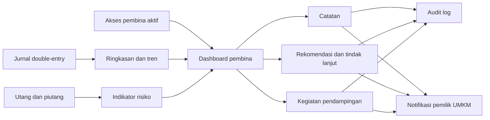

# Modul Pembina UMKM

Modul pembina menyediakan ruang kerja lintas-UMKM untuk pemantauan dan pendampingan. Angka
omzet, pengeluaran, laba, utang, dan piutang dihitung dari jurnal double-entry dan hanya
ditampilkan untuk UMKM yang memberikan akses aktif kepada pembina.

## Batas akses

- Pembina harus memiliki `mentor_business_access` berstatus `ACTIVE` untuk setiap UMKM.
- Ringkasan hanya tersedia jika `can_view_summary=true`.
- Catatan hanya dapat dibuat jika `can_create_notes=true`.
- Role pembina tidak memiliki permission membuat, mengubah, membatalkan, atau membalik
  transaksi. Endpoint transaksi tetap menolak token pembina dengan HTTP 403.
- Catatan, rekomendasi, dan kegiatan hanya dapat dilihat atau diubah oleh pembina yang
  membuatnya. Akses ke UMKM lain dikembalikan sebagai HTTP 404 agar keberadaan tenant tidak
  bocor.

## Indikator kondisi

| Tingkat | Teks UI            | Ikon | Contoh pemicu                                                               |
| ------- | ------------------ | ---- | --------------------------------------------------------------------------- |
| Hijau   | Relatif sehat      | ✓    | Tidak ada indikator yang memerlukan perhatian segera                        |
| Kuning  | Perlu perhatian    | !    | Konsistensi di bawah 50% atau utang ≥ 50% omzet bulanan                     |
| Merah   | Perlu pendampingan | !!   | Tidak mencatat > 7 hari, arus negatif, utang tinggi, atau piutang terlambat |

Warna selalu disertai teks dan ikon. Status ini adalah indikator pendampingan, bukan penilaian
kredit atau diagnosis kesehatan usaha.

## Alur data

## Endpoint API

Semua endpoint berada di `/api/v1/mentors/me` dan memerlukan access token role `mentor`.

| Method | Path                                                            | Kegunaan                    |
| ------ | --------------------------------------------------------------- | --------------------------- |
| GET    | `/dashboard`                                                    | Metrik dan daftar UMKM      |
| GET    | `/businesses`                                                   | Daftar UMKM binaan          |
| GET    | `/businesses/{business_id}`                                     | Detail, tren, dan aktivitas |
| POST   | `/businesses/{business_id}/notes`                               | Membuat catatan             |
| POST   | `/businesses/{business_id}/recommendations`                     | Membuat rekomendasi         |
| PATCH  | `/businesses/{business_id}/recommendations/{recommendation_id}` | Status tindak lanjut        |
| POST   | `/businesses/{business_id}/sessions`                            | Menjadwalkan pertemuan      |
| PATCH  | `/businesses/{business_id}/sessions/{session_id}`               | Mencatat hasil kegiatan     |
| GET    | `/report`                                                       | Laporan agregat             |
| GET    | `/report/export?format=PDF\|XLSX\|CSV`                          | Ekspor pembinaan            |
| GET    | `/audit`                                                        | Audit aktivitas pembina     |

Catatan berstatus `SHARED`, rekomendasi baru, dan jadwal baru membuat notifikasi untuk pemilik
UMKM. Catatan `PRIVATE` tidak mengirim notifikasi.

## Permission

- `mentor.summary.read`
- `mentor.transaction.read` (hanya pembacaan yang disetujui; tidak dipakai untuk mutasi)
- `mentor.note.create`
- `mentor.recommendation.manage`
- `mentor.session.manage`
- `mentor.report.export`

## Website

Rute `/pembina` menampilkan metrik dashboard, pencarian dan filter status, detail UMKM, grafik
tren omzet/laba, indikator risiko, catatan, rekomendasi, tindak lanjut, jadwal, laporan agregat,
ekspor, dan audit. Form divalidasi dengan Zod dan grafik dirender dengan Apache ECharts.
