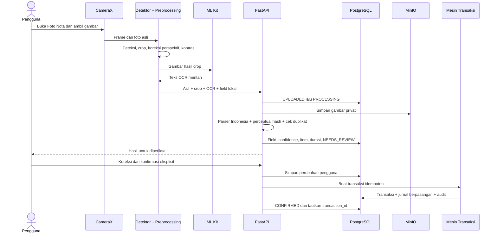

# Modul Foto Nota

## Tujuan dan prinsip keselamatan

Foto Nota membantu pengguna mengubah gambar nota menjadi rancangan transaksi tanpa meminta mereka
memahami debit atau kredit. OCR bersifat rekomendasi. Upload selalu berhenti pada status
`NEEDS_REVIEW`; hanya `POST /confirm` yang dipanggil secara sadar oleh pengguna yang boleh membuat
transaksi dan jurnal berpasangan.

## Alur Android dan backend



## Status

- `UPLOADED`: metadata scan sudah dibuat.
- `PROCESSING`: gambar sedang divalidasi, disimpan, dan diurai.
- `NEEDS_REVIEW`: hasil siap diperiksa; belum ada transaksi.
- `CONFIRMED`: pengguna mengonfirmasi dan transaksi sudah dibuat.
- `FAILED`: proses gagal; alasan aman disimpan dan foto dapat dicoba ulang.

## Data dan object storage

Tabel `receipts` adalah induk satu sesi scan. `receipt_images` menyimpan metadata gambar asli dan
hasil crop; objek biner berada pada bucket MinIO privat dengan key
`businesses/{business_id}/receipt-scans/{receipt_id}/...`. Akses gambar hanya melalui endpoint yang
memeriksa tenant dan permission `receipt.read`; object key atau presigned URL tidak dipublikasikan.

`ocr_results` menyimpan teks mentah, engine, confidence rata-rata, dan durasi. `ocr_fields` menyimpan
nilai per field, teks sumber, confidence, serta nilai koreksi. `receipt_items` menyimpan daftar barang.
Setiap koreksi pengguna ditambahkan secara append-only ke `receipt_corrections`.

## Parser nota Indonesia

Parser menerima variasi `Rp25.000`, `Rp 25.000`, `25.000,00`, dan `25,000`; label total `TOTAL`,
`GRAND TOTAL`, `JUMLAH`, dan `BAYAR`; serta `TUNAI`, `QRIS`, `TRANSFER`, dan `DEBIT`. Parser mencari
nama toko, tanggal, nomor nota, barang, subtotal, diskon, pajak/PPN, total, metode pembayaran,
indikasi pembelian/penjualan, dan kategori yang direkomendasikan. Confidence selalu ditampilkan agar
nilai yang lemah mudah diperiksa.

## Duplikat

Backend menghitung perceptual hash pada gambar hasil preprocessing dan membandingkannya dalam tenant
yang sama. Kandidat dianggap kuat bila nomor nota cocok dengan minimal satu sinyal lain, atau gambar
mirip (Hamming distance maksimal 6) dengan minimal dua sinyal metadata dari tanggal, total, nama
toko, dan nomor nota. Kandidat tidak diblokir permanen, tetapi konfirmasi mewajibkan
`acknowledge_duplicate=true`.

## Endpoint dan izin

- `POST /api/v1/businesses/{business_id}/receipt-scans` — multipart `original`, opsional
  `processed`, `raw_ocr`, dan `client_fields`.
- `GET /api/v1/businesses/{business_id}/receipt-scans/{receipt_id}` — hasil review.
- `GET /api/v1/businesses/{business_id}/receipt-scans/{receipt_id}/images/{ORIGINAL|PROCESSED}` —
  gambar privat.
- `POST /api/v1/businesses/{business_id}/receipt-scans/{receipt_id}/confirm` — koreksi dan
  konfirmasi eksplisit.

Upload memerlukan `receipt.upload`; baca memerlukan `receipt.read`; konfirmasi juga memerlukan
`transaction.create`. Semua query memakai `business_id` dari path dan principal untuk isolasi tenant.

## Batas operasional MVP

OCR utama berjalan di perangkat menggunakan model Latin ML Kit. FastAPI melakukan preprocessing
ulang, parsing, penyimpanan, validasi, dan deteksi duplikat, tetapi belum menjalankan OCR cloud kedua.
Deteksi dokumen Android menggunakan luminance untuk mencari area kertas; pengguna tetap dapat
mengambil foto manual jika bingkai tidak ditemukan. Antrean upload tahan proses mati melalui Room dan
WorkManager merupakan peningkatan produksi berikutnya; pada MVP, kegagalan jaringan mempertahankan
file sementara selama layar scan masih terbuka dan menyediakan tombol coba lagi.

## Verifikasi

```bash
uv run --project apps/api pytest apps/api/tests/test_receipt_ocr.py \
  apps/api/tests/unit/ocr/test_indonesian_receipt_parser.py
cd apps/android
./gradlew ktlintCheck testDebugUnitTest assembleDebugAndroidTest
```
