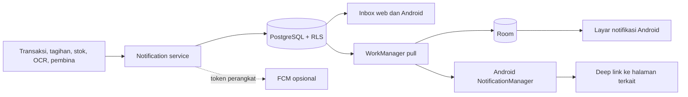

# Notifikasi KASTA

Modul notifikasi menyatukan inbox web/Android, pengingat lokal Android, preferensi per pengguna,
dan kontrak perangkat untuk kanal push opsional. Semua query menggunakan `business_id` dari token
dan hanya mengembalikan baris dengan `user_id` penerima yang sedang masuk.

## Kategori

- `NO_TRANSACTION_TODAY`: belum mencatat transaksi hari ini.
- `PAYABLE_DUE_SOON` dan `RECEIVABLE_DUE_SOON`: utang/piutang mendekati atau melewati jatuh tempo.
- `LOW_STOCK`: stok berada pada atau di bawah batas minimum.
- `OCR_NEEDS_REVIEW`: hasil foto nota harus dikonfirmasi.
- `SYNC_FAILED`: sinkronisasi perangkat memiliki kegagalan terakhir.
- `MENTOR_ACCESS_REQUEST`: permintaan akses pembina.
- `NEW_RECOMMENDATION`: rekomendasi baru atau tindak lanjut pembina.
- `MENTORING_SCHEDULE`: jadwal pendampingan.
- `MONTHLY_REPORT_AVAILABLE`: laporan bulan sebelumnya tersedia.

## Alur

Android menjalankan dua pekerjaan periodik unik:

1. `kasta-notification-pull` memerlukan jaringan, menarik inbox, menyimpan ke Room, dan menampilkan
   item yang sudah melewati `available_at`.
2. `kasta-local-reminders` tidak memerlukan jaringan dan memeriksa transaksi Room untuk pengingat
   harian. ID stabil per tanggal mencegah notifikasi ganda.

Jam tenang dapat melintasi tengah malam, misalnya 21:00–07:00. Backend menunda `available_at` ke
akhir jam tenang; Android juga menahan pengingat lokal selama rentang tersebut.

## API

Semua endpoint berada di `/api/v1/businesses/{business_id}/notifications`.

| Metode | Path | Fungsi |
| --- | --- | --- |
| GET | `/` | Daftar inbox penerima aktif |
| GET | `/unread-count` | Jumlah belum dibaca |
| POST | `/{notification_id}/read` | Tandai satu item dibaca |
| POST | `/read-all` | Tandai semua dibaca |
| GET/PUT | `/preferences` | Baca atau ubah kategori, waktu, quiet hours, dan kanal |
| PUT | `/push-subscription` | Daftarkan token perangkat untuk provider push |
| POST | `/evaluate?as_of=YYYY-MM-DD` | Evaluasi reminder idempoten milik pengguna aktif |

FCM bersifat opsional. Token perangkat dapat diregistrasikan, tetapi kredensial Firebase dan
`google-services.json` tidak disimpan dalam repository. Saat kanal FCM diaktifkan pada suatu
environment, kredensial harus berasal dari secret manager. Email juga default nonaktif dan
dikontrol oleh `email_enabled`.

## Keamanan dan operasional

- PostgreSQL RLS membatasi `SELECT`/`UPDATE` ke `user_id` penerima dan tenant aktif.
- Generator hanya dapat membuat data di tenant dari konteks JWT.
- Unique constraint penerima-kategori-entitas-tanggal membuat evaluasi aman untuk retry.
- Perubahan preferensi dan proses generator dicatat ke `audit_logs`.
- Scheduler produksi dapat memanggil endpoint evaluasi atau service yang sama sekali sehari; tidak
  boleh menjalankan query lintas tenant tanpa menetapkan konteks RLS.
