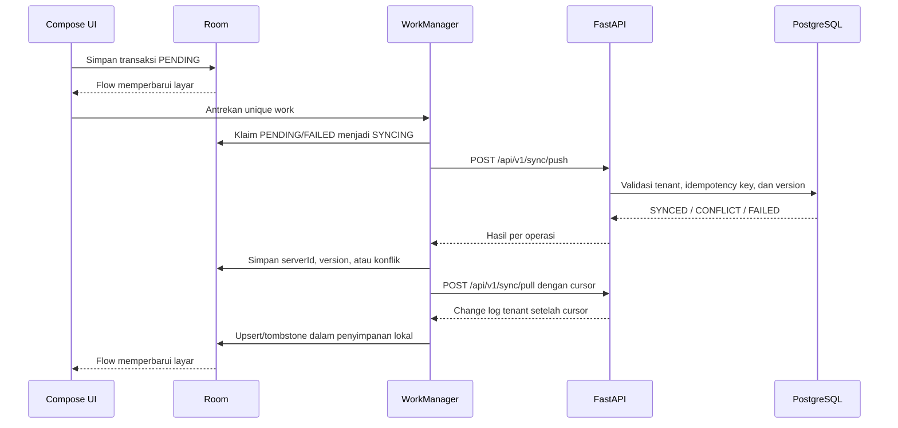

# Sinkronisasi Offline-First Android

Room adalah sumber data utama aplikasi Android. Layar membaca `Flow` dari Room; respons jaringan
tidak langsung menjadi state UI sebelum disimpan ke Room.

## Metadata lokal

Setiap transaksi lokal menyimpan `localId`, `serverId`, `businessId`, `deviceId`, `version`,
`syncStatus`, `createdAt`, `updatedAt`, dan `deletedAt`. Nilai `syncStatus` yang sah adalah:

- `PENDING`: perubahan menunggu dikirim;
- `SYNCING`: baris telah diklaim worker secara atomik;
- `SYNCED`: versi lokal sama dengan versi server;
- `FAILED`: pengiriman gagal dan dapat dicoba lagi;
- `CONFLICT`: transaksi keuangan berubah di perangkat lain dan perlu keputusan pengguna.

Draft dibedakan dengan `isDraft` dan tidak dikirim sampai pengguna memilih untuk mencatatnya.

## Alur



WorkManager hanya berjalan ketika jaringan tersedia dan memakai backoff eksponensial. Cursor pull,
waktu sinkronisasi terakhir, dan ID instalasi Android disimpan dengan DataStore. ID instalasi berbeda
untuk dua perangkat meskipun akun dan usaha sama.

## Kontrak API

- `POST /api/v1/sync/push`: menerima batch maksimal 100 operasi. `operation_id` stabil selama retry
  sehingga permintaan duplikat mengembalikan hasil sebelumnya.
- `POST /api/v1/sync/pull`: mengembalikan change log setelah cursor dan cursor berikutnya.
- `GET /api/v1/sync/status`: mengembalikan waktu push/pull, cursor, dan jumlah konflik terbuka.

Semua request membawa `business_id`; backend membandingkannya dengan tenant pada JWT. PostgreSQL RLS
diterapkan pada record, operation log, change log, status perangkat, dan conflict revision.

## Konflik dan penghapusan

Data nonkeuangan `PREFERENCE` dan `DRAFT` boleh memakai last-write-wins. Transaksi keuangan tidak
pernah ditimpa otomatis. Jika `base_version` tidak sama dengan versi server, backend menyimpan kedua
snapshot pada `sync_conflict_revisions` dan Android menampilkan halaman penyelesaian konflik. Pengguna
dapat memakai versi server atau mengirim versi perangkat sebagai revisi terkontrol.

Penghapusan direpresentasikan dengan `deletedAt` (tombstone). Untuk transaksi yang telah diposting,
aksi DELETE di server menjalankan reversal jurnal dan tidak menghapus transaksi maupun jurnal.

## Pengujian

Backend menguji create offline, idempotensi request duplikat, pull perangkat kedua, konflik versi,
conflict revision, status, dan isolasi tenant. Unit test Android menguji state awal offline, keputusan
retry worker, hasil sukses worker, dan tombstone. Test Android dijalankan dengan:

```bash
cd apps/android
./gradlew ktlintCheck testDebugUnitTest
```
